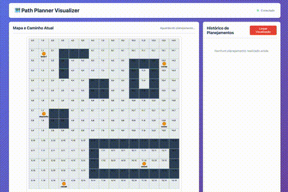
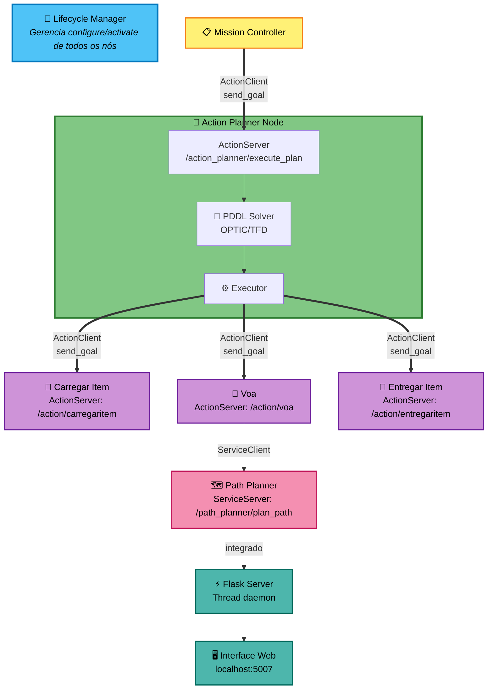

# 🚁 Action Planner - Autonomous Drone Mission System

[](https://docs.ros.org/en/humble/)
[](https://www.docker.com/)
[](https://www.python.org/)

Sistema autônomo de planejamento e execução de missões para drones usando **ROS2**, **PDDL** (Planning Domain Definition Language) e **algoritmo de Dijkstra** para pathfinding com visualização web em tempo real.



## 📑 Índice

- [Pré-requisitos](#-pré-requisitos)
- [Instalação e Execução](#-instalação-e-execução)
- [Arquitetura](#-arquitetura)
- [Visualizador Web](#-visualizador-web)
- [Desenvolvimento](#-desenvolvimento)
- [Estrutura do Projeto](#-estrutura-do-projeto)

## 📋 Pré-requisitos

- **Docker** (recomendado) OU
- **ROS2 Humble**
- **Python 3.10+**
- **Navegador Web** (Chrome, Firefox, Safari, Edge)

## 🚀 Instalação e Execução

### Opção 1: Docker (Recomendado)

#### Build da imagem
```bash
docker build -t action_planner .
```

#### Execução Interativa
```bash
docker run -it -v ./pddl:/pddl -p 5007:5007 action_planner
# Dentro do container
ros2 launch launch/launch.py
```

#### Execução Automática
```bash
docker run -it -v ./pddl:/pddl -p 5007:5007 action_planner /usr/local/bin/start-ros2.sh
```

#### Execução em Background (Daemon)
```bash
# Iniciar
docker run -d --name action_planner_running \
  -v ./pddl:/pddl \
  -p 5007:5007 \
  action_planner /usr/local/bin/start-ros2.sh

# Ver logs
docker logs -f action_planner_running

# Acessar container
docker exec -it action_planner_running /bin/bash

# Parar e remover
docker stop action_planner_running
docker rm action_planner_running
```

### Opção 2: Build Local (Sem Docker)

```bash
# Clonar repositório
git clone https://github.com/RaphaelBonaccorsi/action_planner.git
cd action_planner

# Source ROS2
source /opt/ros/humble/setup.bash

# Build workspace
colcon build --symlink-install

# Source workspace
source install/setup.bash

# Executar
ros2 launch launch/launch.py
```

## 🏗️ Arquitetura



**📖 Legenda de Comunicação ROS2:**
- **ActionClient/send_goal**: Cliente ROS2 Action que envia requisição (goal) para um ActionServer executar tarefa assíncrona
- **ActionServer**: Servidor que recebe goals, executa ações e retorna resultados/feedback
- **ServiceClient**: Cliente que faz requisição síncrona a um ServiceServer e aguarda resposta
- **ServiceServer**: Servidor que processa requisições síncronas e retorna respostas imediatas

### 🔄 Fluxo de Execução

1. **Inicialização**: Lifecycle Manager configura e ativa todos os nós
2. **Disparo**: Mission Controller envia goal para Action Planner
3. **Planejamento**: Solver PDDL gera sequência de ações
4. **Execução Sequencial**: Executor cria ActionClients dinamicamente e executa:
   - Carregar item → Voa → Entregar item
5. **Navegação**: Action "Voa" solicita rota ao Path Planner via service
6. **Visualização**: Path Planner atualiza servidor Flask em tempo real

### 🔑 Componentes Principais

**🔧 Lifecycle Manager**
- Gerencia transições de estado (configure → activate)
- Controla: Mission Controller, Action Planner, Action Nodes, Path Planner

**📋 Mission Controller**
- ActionClient para `/action_planner/execute_plan`
- Dispara execução da missão

**🎯 Action Planner (Lifecycle Node)**
- **ActionServer**: Recebe goals de execução
- **PDDL Solver**: Gera plano usando OPTIC/TFD
- **Executor**: Orquestra execução sequencial
  - Cria ActionClients dinamicamente para cada ação
  - Valida precondições e aplica efeitos
  - Gerencia estado global (Action Planner Memory)

**🔹 Action Nodes (Lifecycle independentes)**
- `carregaritem`: ActionServer `/action/carregaritem`
- `voa`: ActionServer `/action/voa` + ServiceClient para path planning
- `entregaritem`: ActionServer `/action/entregaritem`

**🗺️ Path Planner (Service Server)**
- ServiceServer: `/path_planner/plan_path`
- Algoritmo Dijkstra em grid 15x15
- Integra servidor Flask para visualização

**🌐 Web Visualizer**
- Flask REST API em thread daemon
- Interface HTML5 Canvas
- Porta: `http://localhost:5007`

## 🎨 Visualizador Web

### Acesso
Após iniciar o sistema, abra no navegador:
```
http://localhost:5007
```

### Funcionalidades

#### 🗺️ Visualização do Grid
- **Grid Map**: Mapa 15x15 com células de 50x50 pixels
- **Obstáculos**: Blocos em cinza escuro representando áreas inacessíveis
- **Localizações**: Círculos laranjas marcando pontos de interesse
- **Coordenadas**: Labels pretos dentro de cada célula para referência
- **Legenda Visual**: Cores e símbolos explicados

#### 📍 Representação de Caminhos
- **Linha Verde**: Trajetória planejada entre origem e destino
- **Círculo Azul**: Ponto de origem da rota
- **Círculo Vermelho**: Ponto de destino da rota
- **Pontos Intermediários**: Waypoints ao longo do caminho

#### 📜 Histórico de Planejamentos
- **Timeline Reverso**: Execuções mais recentes no topo
- **Filtro por Status**: Sucesso (verde) ou Falha (vermelho)
- **Clique para Revisitar**: Selecione qualquer execução passada
- **Detalhes**:
  - Timestamp preciso
  - Rota (origem → destino)
  - Número de waypoints
  - Mensagem de status

#### ⚡ Atualizações em Tempo Real
- **Polling Automático**: Atualiza a cada 1 segundo
- **Thread-Safe**: Servidor Flask em thread daemon
- **API REST**: Endpoints para integração
  - `GET /` - Interface web
  - `GET /api/grid` - Dados do grid
  - `GET /api/history` - Histórico completo
  - `GET /api/latest` - Última execução
  - `GET /api/health` - Health check

### 💡 Valor Agregado

O visualizador web oferece:

- **Transparência Operacional**: Visibilidade completa do processo de pathfinding
- **Debug Facilitado**: Identificação rápida de problemas em rotas
- **Análise Histórica**: Comparação de execuções para otimização
- **Monitoramento Remoto**: Acesso via navegador de qualquer dispositivo na rede

### 🎨 Tecnologias

- **Backend**: Flask 3.0.0 + Flask-CORS 4.0.0
- **Frontend**: HTML5 Canvas + Vanilla JavaScript
- **Arquitetura**: REST API thread-safe

## 🛠️ Desenvolvimento

### Criar Novos Action Nodes

> **Nota**: Os diretórios `templates/` e `static/` contêm arquivos do visualizador web que são acessados em runtime pelo servidor Flask e não precisam ser instalados pelo CMakeLists.

1. **Criar script Python** em `action_planner/scripts/`:

```python
from action_executor_base import ActionExecutorBase

class MinhaAcao(ActionExecutorBase):
    def __init__(self):
        super().__init__("minha_acao")  # Nome da ação
    
    def new_goal(self, parameters):
        # Lógica de execução
        arg1 = parameters[0]
        arg2 = parameters[1]
        # ... implementação
        return True  # ou False
```

2. **Adicionar ao CMakeLists.txt**:

```cmake
install(PROGRAMS 
  scripts/minha_acao.py
  DESTINATION lib/${PROJECT_NAME})
```

> **Nota**: Scripts auxiliares como `path_visualizer.py`, `action_planner_executor.py`, `action_planner_memory.py` e `action_executor_base.py` são importados pelos nós principais e não precisam ser listados no `install(PROGRAMS ...)`.

3. **Registrar no Lifecycle Manager** (`scripts/lifecycle_manager.py`):

```python
nodes = [
    {
        'node_name': 'minha_acao',
        'depends_on': []  # ou lista de dependências
    },
    # ... outros nós
]
```

4. **Definir no PDDL** (`pddl/domain.pddl`):

```lisp
(:action minha_acao
    :parameters (?arg1 ?arg2)
    :precondition (and
        ; precondições
    )
    :effect (and
        ; efeitos
    )
)
```

### Modificar PDDL Problem

Edite `pddl/problem.pddl` para definir:
- Objetos (`objects`)
- Estado inicial (`init`)
- Objetivo da missão (`goal`)

**Exemplo**:
```lisp
(:objects 
    drone1 - drone
    item1 item2 - item
    base casaA casaB - location
)

(:init
    (at drone1 base)
    (at item1 base)
)

(:goal
    (and (at item1 casaA))
)
```

### Expandir Grid Map

Modifique `action_planner/scripts/path_planner.py`:

```python
# Tamanho do grid
self.grid_map = np.zeros((20, 20), dtype=int)  # Altere dimensões

# Adicionar obstáculos
self.grid_map[5:8, 10:15] = 1  # Bloco de obstáculos

# Adicionar localizações
self.location_coords = {
    'nova_casa': (18, 18),
    # ... outras localizações
}
```

## 📂 Estrutura do Projeto

```
action_planner/
├── action_planner/
│   ├── scripts/
│   │   ├── action_executor_base.py       # Classe base para actions
│   │   ├── action_planner_executor.py    # Executor de planos
│   │   ├── action_planner_memory.py      # Gerenciamento de estado
│   │   ├── action_planner.py             # Nó principal do planner
│   │   ├── carregaritem.py               # Action: carregar item
│   │   ├── entregaritem.py               # Action: entregar item
│   │   ├── voa.py                        # Action: voar entre locais
│   │   ├── path_planner.py               # Dijkstra pathfinding + visualizer
│   │   ├── path_visualizer.py            # Módulo de visualização Flask
│   │   ├── lifecycle_manager.py          # Gerenciador de lifecycle
│   │   └── mission_controller.py         # Controlador de missões
│   ├── src/harpia_msgs/                  # Mensagens e actions customizadas
│   ├── solver/                           # PDDL solvers (OPTIC, TFD)
│   ├── launch/
│   │   └── launch.py                     # Launch file ROS2
│   ├── templates/
│   │   └── path_visualizer.html          # Interface web
│   ├── static/
│   │   ├── style.css                     # Estilos
│   │   └── visualizer.js                 # Lógica frontend
│   ├── output/                           # Diretório para saídas do planner
│   ├── CMakeLists.txt
│   └── package.xml
├── pddl/
│   ├── domain.pddl                       # Domínio PDDL
│   └── problem.pddl                      # Problema PDDL
├── Dockerfile                             # Container definition
├── demo.gif                               # Demonstração visual
└── readme.md                              # Este arquivo
```

---

<div align="center">

### 🛠️ Tecnologias Principais


</div>
